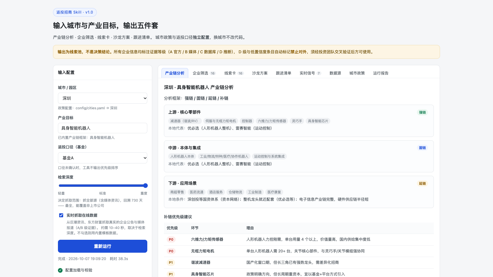
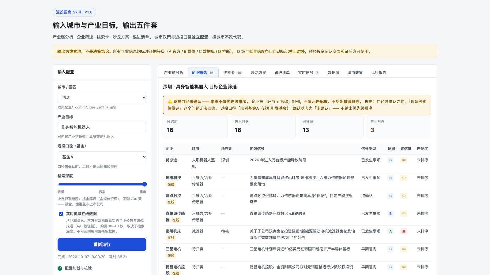
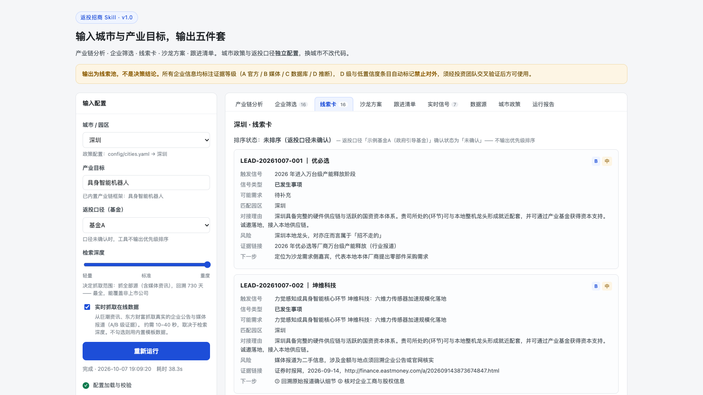
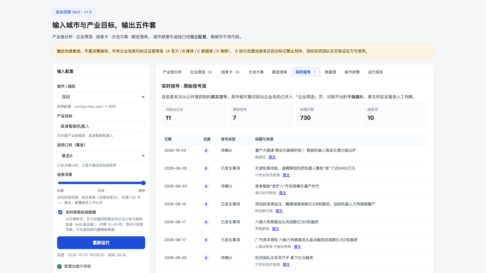
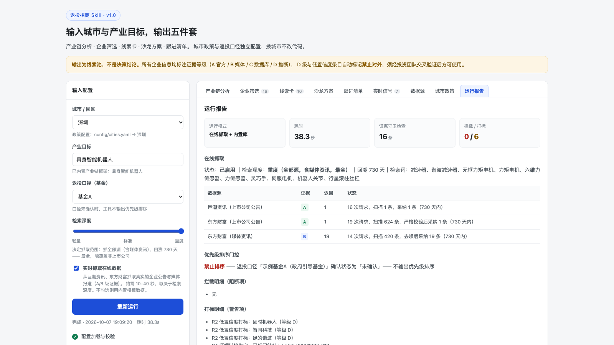

# 返投招商 Skill

输入「城市 + 产业目标」，输出五件套：**产业链分析 · 企业筛选 · 线索卡 · 沙龙方案 · 跟进清单**。

城市政策与返投口径**独立配置**，换城市只改 YAML，不改代码。

**支持实时抓取真实数据** —— 勾选「实时抓取在线数据」，会从 3 个公开数据源抓取真实的
企业扩张信号（公告 + 媒体报道），并强制标注证据等级。



---

## 这是一个 AI + FDE 项目

> **由一个人、借助 AI，在 5 个工作日内完成一次完整的「驻场交付」**：
> 从一个模糊的政府招商需求（"帮我找企业"），到一份甲方能直接拿去干活的工具。

| | |
|---|---|
| **交付周期** | 2026-09-29 → 2026-10-08，实际投入集中 **5 个工作日** |
| **代码量** | **3,022 行**（Python 1,742 + HTML 721 + YAML 439 + 企业库 120） |
| **一手调研** | 11 个数据源逐个实测（**仅 3 个可用**）、4 城政策、1 条产业链、6 家企业 |
| **交付物** | 可点击工具 + 5 份结构化产物 + 2 版演示视频 + 3 份商务/评估文档 |
| **单次效率** | 传统人工 **3–5 人天** → 本工具 **35–40 秒**（+ 人工复核 0.5–1 小时） |

**为什么它是标准的 FDE（Forward Deployed Engineer）项目**：

| FDE 的标准动作 | 本项目对应的动作 |
|---|---|
| 进现场，听懂真实需求 | 识别出需求不是"找企业"，而是**"找扩张信号"**，且**越早越好** |
| 先摸数据，不急着写代码 | 11 个候选源逐个实测，**8 个不可用**（百度新闻 0/5、企查查被 WAF 拦…） |
| 把领域 know-how 变成系统 | 返投口径 / 补链优先级 / 证据分级 → 全部外置成 YAML |
| 一个人交付完整链路 | 调研 → 数据层 → 引擎 → 前端 → 演示视频 → 商务方案 |
| 交付"问题被解决"，不是"代码" | 除工具外，还交付工时说明、分期方案、决策点、边界声明 |
| 主动划边界，管理预期 | 明确写出"不做什么"，并把硬约束写进代码（`EvidenceGuard` R1–R5） |

> 📄 **完整梳理见 [`AI-FDE项目梳理与定位.md`](AI-FDE项目梳理与定位.md)** ——
> 含方案全景、**AI+金融行业 8 个痛点 × 本项目解法**、FDE 能力矩阵、三版对外叙事、可复用的 FDE 六步法。

### 这个项目解决了 AI + 金融的哪些痛点

每一条都来自**实测**，不是行业观察的转述。

| # | 痛点 | 本项目实测 / 解法 |
|---|---|---|
| 1 | **数据不是不够，是"接不上"** | 11 个候选源**只有 3 个可用**（27%）；用数据源适配层强制声明「证据等级/成本/合规/凭证」，不可用的源也留在清单里写明原因 |
| 2 | **幻觉在金融场景不可接受** | `EvidenceGuard` **只拦截、不生成**；A/B/C/D 证据分级贯穿全链路；D 级与低置信度自动打「禁止对外」 |
| 3 | **最贵的错误是"找到了错的"** | 公告源噪音率 **99.7%**（733 条召回仅 2 条真信号）→ 模糊召回 + 严格二次校验，**宁可少，不可错** |
| 4 | **信号时效与决策时效错配** | 把"该往哪投"变成一张表：招投标 > 环评 > 备案 > 公告 > 工商 > 招聘 > 融资 |
| 5 | **非上市企业是数据黑箱** | 内置 6 家企业里 3 家非上市，而公告源只覆盖上市公司 → 引入资讯源（B 级），实测抓到深创投加注的非上市标的 |
| 6 | **领域 know-how 锁在人脑里** | 配置驱动，换城市只加一个键；**口径只承载、不生成**，未确认时拒绝排序 |
| 7 | **合规是红线，不是加分项** | 不绕过反爬、内置限速、不转售订阅数据；LP 材料能否进外部模型列为**阻塞项** |
| 8 | **成本结构错位：瓶颈不在模型** | 数据成本（企查查核验 ≈¥186/次）比 token 高约 **600 倍** → 先跑通 → 再补数据 → 最后接模型 |

---

## 快速开始

### 方式一：双击启动（推荐，无需命令行）

在访达里打开 `/Users/luka7/project/fantou-skills/`，**双击 `启动.command`** 即可。
脚本会自动找 Python、检查依赖、启动服务并打开浏览器。

停止：双击 `停止.command`。

> 首次双击若提示「无法打开，因为它来自身份不明的开发者」，
> 在「系统设置 → 隐私与安全性」里点「仍要打开」即可（只需一次）。

### 方式二：命令行

```bash
cd /Users/luka7/project/fantou-skill

./start.sh              # 启动（自动开浏览器）
./start.sh --no-browser # 启动但不开浏览器
./start.sh 9000         # 换端口
./stop.sh               # 停止
```

不想用脚本的话，原始命令是：

```bash
cd /Users/luka7/project/fantou-skill
/Users/luka7/.workbuddy-ai/binaries/python/envs/default/bin/python3 app.py 8848
```

### 然后

浏览器打开 `http://127.0.0.1:8848`，选城市 → 点「运行 Skill」→ 看九个标签页。

**服务只绑定 127.0.0.1（本机），不对外暴露。** 依赖只有 `pyyaml`（脚本会自动装）。

> 💡 **后端没启动也不会白屏**：页面会自动加载内置兜底数据，功能完整可浏览
> （兜底数据里也含真实抓取结果）。

---

## 实时抓取真实数据

勾选左侧「**实时抓取在线数据**」后运行，会真实请求以下数据源：

| 数据源 | 证据等级 | 抓什么 | 耗时 |
|---|---|---|---|
| 巨潮资讯 | A | 上市公司公告 | ~10 秒 |
| 东方财富（公告） | A | 上市公司公告 | ~14 秒 |
| 东方财富（资讯） | B | 权威媒体报道 ★ | ~12 秒 |

一次完整抓取约 **35–40 秒**（含限速）。

**为什么需要「东方财富（资讯）」**：招商目标大量是**非上市公司**，而公告类数据源只覆盖上市公司。
实测巨潮 8 个环节词回溯 2 年只命中 6 条相关公告；资讯源能抓到
「鑫精诚传感器完成数亿元 B 轮融资（深创投连续加注）」「蓝点触控完成数亿元 D 轮融资」
这类非上市公司的真实信号。

**抓到的数据怎么处理**：

- 能可靠识别出企业名的 → 并入「企业筛选」，自动推断所属环节与补链优先级
- 识别不出企业名的 → **不做脑补**，原文进「实时信号」页，供人工判断
- 所有记录强制标注证据等级（A/B/C/D）与来源链接

---

## 界面一览

| 企业筛选（含证据等级 / 置信度） | 线索卡（一企一卡） |
|---|---|
|  |  |

| 实时信号（原始抓取信号流） | 运行报告（证据守卫拦截明细） |
|---|---|
|  |  |

> 截图取自「深圳 + 具身智能机器人 + 基金A + 重度检索」的一次真实跑通（含在线抓取）。

---

## 演示视频

有两版，**给不同的人看，不要给错**：

| 版本 | 文件 | 用途 |
|---|---|---|
| **内部版** | `demo/返投招商Skill演示.mp4` | 自己复盘、给合作方看完整形态 |
| **对外版** | `demo/返投招商Skill演示_对外版.mp4` | 给甲方/潜在客户看。脱敏 + 水印 + 难度说明片尾卡 |

两版都是「深圳 + 具身智能机器人 + 基金A + 重度检索」的真实一次跑通：
选城市 → 勾选实时抓取 → 点运行 → 抓取 38 秒（**快放 8 倍**，否则观众干等）→ 逐个走完标签页。

### 对外版做了什么

**遮蔽**（`demo/mask-client.js`，运行时注入）：

| 遮蔽项 | 原因 |
|---|---|
| 检索词 → 「共 N 组 · 按产业链环节自动展开」 | 检索词本身就是行业 know-how |
| 各数据源状态表 → 汇总口径 | 每源的返回量 = 取数地图，等于告诉对方哪条路走得通 |
| 候选数据源清单 → 「另有 N 个在评估中」 | 9 个源的清单与接入成本 |
| 配置文件路径 → 「（外置配置文件）」 | 工程结构 |
| 实测结论原文 → 通用表述 | 调研结论 |

遮蔽是**自动跟随 DOM 变化**的（MutationObserver），不是只在几个固定点调用 ——
手动调用漏过两次，左栏那处 `config/cities.yaml` 在每一帧都可见，是最持久的泄露点。

**页面级脱敏**（`?demo=1`）：`web/index.html` 里左栏提示在**首屏**就渲染，
`record start` 会重载页面、注入只能在其之后，所以靠运行时替换永远会漏掉开头几帧。
给页面加了个开关，`?demo=1` 时左栏直接渲染成「政策配置：外置配置文件」。

**水印**：`demo/watermark.ass`，左下角「内部资料 · 请勿外传」，全时段。

**难度说明片尾卡**（`demo/closing-card.html`）：9 秒静帧，摊开 4 条实测坑
（9 源 6 不可用 / 99.7% 噪音率 / 跨行业企业漏网 / 宁可少不可错）。
**这张卡比遮蔽更防白嫖** —— 对外演示最大的风险不是「被抄代码」，
而是「看起来太简单」，把工程量摊开反而建立信任。

### 重新录制（改了界面后要重录时）

```bash
cd /Users/luka7/project/fantou-skill
./start.sh --no-browser                       # 服务必须在跑

# 内部版
bash demo/record.sh
python3 demo/gen_subs.py
bash demo/transcode.sh

# 对外版（脱敏 + 水印 + 片尾卡）
CLIENT=1 bash demo/record.sh
CLIENT=1 python3 demo/gen_subs.py
CLIENT=1 bash demo/transcode.sh
```

产物落在 `demo/`：

| 文件 | 作用 |
|---|---|
| `record.sh` | 录制：注入虚拟光标 → 操作 → 打时间戳（`CLIENT=1` 走 `?demo=1` + 注入遮蔽） |
| `cursor-inject.js` | 虚拟鼠标光标（录屏里能看到操作轨迹 + 点击涟漪） |
| `mask-client.js` | 对外版脱敏（自动跟随 DOM 变化） |
| `closing-card.html` / `.png` | 难度说明片尾卡 |
| `watermark.ass` | 对外版水印 |
| `gen_subs.py` | 读打点生成 ASS 字幕，**不靠人算时间** |
| `transcode.sh` | 等待段加速 + 烧字幕（+ 片尾卡 + 水印）+ 转 H.264 MP4 |
| `subs.ass` | 生成的字幕（可手改文案） |
| `raw/` | 原始录像与时间戳（可删） |

### 坑（重录前务必知道）

1. **agent-browser 录制依赖系统 `ffmpeg`** —— 不在 PATH 里就会「录制成功但文件不生成」。
   `record.sh` 已自动从 imageio-ffmpeg 软链一个出来。
2. **别用 CLI 的 `click` 切标签页** —— 长会话里会静默失败（配合 `>/dev/null` 就是无声无息）。
   `record.sh` 改用页面内 JS 触发，并在点击后**回读激活标签校验**。
3. **字幕时间别手算** —— 命令开销会累积几秒误差，导致字幕说「企业筛选」而画面还在「产业链分析」。
   `record.sh` 每个动作打点，`gen_subs.py` 按点生成。
4. **改完后端代码必须重启服务再录** —— 否则录的是旧代码跑出来的数据。
   第一次录完就踩了这个：命令行验证数据是干净的，但服务进程还是旧的，视频里带着噪音。
5. **`record start <path> <url>` 会重载页面**，之前注入的 JS 全丢；不带 URL 则是空白页且不生成文件。
6. **注入含中文的 JS 必须走 `TextDecoder`** —— `atob()` 只解出 Latin-1 字节串，
   所有基于中文关键词的判断会**静默失效**。`record.sh` 里的 `inject_file()` 已处理并回读校验。
7. **脱敏函数必须幂等** —— 否则 MutationObserver 反复触发会把「共 10 组」改成「共 1 组」。


---

## 操作指引

### 日常使用（3 步）

1. **选城市** —— 下拉框列出 `config/cities.yaml` 里已配置的城市
2. **填产业目标** —— 默认「具身智能机器人」，对应 `config/industries.yaml` 的产业链框架
3. **选基金** —— 决定返投口径；不选则不做优先级排序

点「运行 Skill」，离线模式 1 秒内出结果，在线抓取模式约 40 秒。九个标签页：

| 标签页 | 内容 |
|---|---|
| 产业链分析 | 强链/固链/延链/补链四类判断 + 补链优先级 P0/P1/P2 |
| 企业筛选 | 企业清单 + 匹配度打分 + 证据等级 + 置信度 |
| 线索卡 | 一企一卡，含触发信号、风险、下一步 |
| 沙龙方案 | 议程 + 邀约理由模板 + 评价指标 |
| 跟进清单 | 11 列结构化表 |
| **实时信号** | **原始抓取信号流（含媒体、日期、原文链接）** |
| 数据源 | 11 个数据源的证据等级 / 成本 / 合规 / 接入条件 |
| 城市政策 | 当前城市的政策配置全貌 + 待核项 |
| 运行报告 | 证据守卫拦截明细 + 耗时 + 数据源状态 + 配置来源 |

### 换城市（截图核心要求）

**只改 `config/cities.yaml`，不改代码。** 加一个键即可：

```yaml
合肥:
  名称: 合肥
  筹码类型: 资本型
  招商路径: 顺水推舟型
  一句话定位: ...
  产业基础: {...}
  政策文件:
    - 名称: 《...》
      来源: 合肥市人民政府
      等级: A
  政策工具: [...]
  稀缺筹码: [...]
  邀约理由模板: "..."
  来源汇总: [...]
  待核项: [...]
```

重启服务，下拉框里就多了「合肥」。

### 配返投口径

编辑 `config/fantou_rules.yaml`，逐只基金一段：

```yaml
基金D:
  基金名称: 某某政府引导基金
  返投倍数: 1.5
  认定范围: [新设主体, 迁入主体, 新增产能投资]
  是否含研发中心: false
  确认状态: 未确认
```

> ⚠️ **`确认状态` 不是「已确认」时，工具不会输出线索优先级排序。**
> 理由：口径没确认之前，「哪条线索值得追」这个问题无法回答。
> 口径来自 LPA，须法务逐只基金确认——工具只做承载，不生成口径。

### 补充企业数据

编辑 `kb/companies.yaml`。**每条必须带证据等级**：

| 等级 | 定义 | 可否对外 |
|---|---|---|
| A | 官方公示 / 政府文件 / 企业公告 / 年报 | ✅ 可直接引用 |
| B | 权威媒体 / 行业协会 / 机构研报 | ✅ 需标注来源 |
| C | 商业数据库（企查查等）结构化字段 | ⚠️ 需人工抽检 |
| D | 模型推断 / 行业惯例推测 | ❌ **禁止对外** |

标 D 级或置信度「低」的条目，工具会自动打上「禁止对外」标记。

---

## 证据守卫（EvidenceGuard）

这是本工具最关键的模块。**它不生成内容，只做拦截。**

| 规则 | 内容 |
|---|---|
| R1 | 每条企业记录必须有证据等级，缺失则拦截 |
| R2 | 证据等级 D 或置信度「低」→ 自动标记「禁止对外」 |
| R3 | 沙龙方案的评价指标不得含「参会人数 / 曝光量 / 名片」类考核项 |
| R4 | 跟进清单「证据链接」为空的记录标记「待补充」 |
| R5 | 返投口径未确认 → 禁止输出优先级排序 |

为什么把它放在架构核心位置：招商场景最大的风险不是「产出质量差」，
而是**把推断当事实发给政府 LP**。一次这样的错误，关系成本远超省下来的全部人工。

---

## 目录结构

```
fantou-skills/
├── 启动.command             # ★ 双击启动（访达里用）
├── 停止.command             # ★ 双击停止
├── start.sh / stop.sh       # 命令行启停脚本
├── app.py                   # 本地前端服务
├── engine.py                # 五段流水线引擎 + EvidenceGuard
├── build_fallback.py        # 生成离线兜底数据（--live 可烘入真实抓取结果）
├── web/
│   ├── index.html           # 前端界面（9 个标签页）
│   └── fallback.js          # 离线兜底数据（后端未启动时用）
├── datasources/             # 数据源适配层
│   ├── base.py              # 基类：强制声明 证据等级/成本/合规/凭证
│   ├── cninfo.py            # ✅ 巨潮资讯
│   ├── eastmoney.py         # ✅ 东方财富（公告 + 资讯）
│   ├── stubs.py             # ⬜ 已登记待接入（企查查/环评/招投标等）
│   └── registry.py          # 注册表
├── config/
│   ├── cities.yaml          # 城市政策（亦庄 / 深圳 / 苏州 / 陕西）
│   ├── fantou_rules.yaml    # 返投认定口径（逐只基金）
│   └── industries.yaml      # 产业链框架 + 证据等级 + 检索词 + 沙龙默认
├── kb/
│   └── companies.yaml       # 企业库（含来源与证据等级）
├── demo/                    # 演示视频与录制工具链
├── demo-shots/              # 界面截图（README 用）
├── AI-FDE项目梳理与定位.md   # ★ AI+FDE 视角的项目梳理与作品集叙事
├── 实现方案与计划.md          # 设计文档
├── 数据源方案.md             # 数据源实测与选型
├── 项目评估与改进清单.md      # 逐项核查的评估结论
├── 甲方答复_调研工时与合作安排.md  # 工时口径 + 分期方案（⚠️ 不进版本库，见 .gitignore）
└── 甲方答复_正式录用后的安排.md    # 分期安排 + 里程碑决策点（⚠️ 不进版本库，见 .gitignore）
```

> ⚠️ **两份「甲方答复」文档含调研工时与报价口径，属商务敏感信息，已在 `.gitignore` 中排除**
> （规则：`甲方答复_*.md`）。克隆仓库后这两份文件不会出现，本地才有。

**新增数据源只需三步**：在 `datasources/` 写一个类继承 `DataSource` → 在 `registry.py` 注册
→ 前端「数据源」页自动出现，无需改前端。

---

## 当前状态与边界

**已实现**：五段流水线、证据守卫、配置驱动、前端界面、运行报告、
**3 个真实数据源在线抓取**、离线兜底。

**运行模式**：
- **离线模板模式（M1）** —— 不联网，用配置 + 企业库 + 模板组装产物。零成本、结果确定
- **在线抓取模式** —— 从公开源抓真实信号，约 40 秒。仍不调用大模型

**未实现**：

- LLM 模式（接 OpenAI 兼容 API 做真实生成）—— 需要 API key
- 商业数据源接入（企查查等）—— 需要权限与预算
- 环评公示 / 招投标适配 —— 需按地区/平台逐个抓包适配（实测 3 个平台均需额外适配）
- 飞书写入 —— 按你的要求已排除

**数据边界**：城市政策均来自官方文件或权威媒体（A/B 级，见各城市 `来源汇总`）；
在线抓取的企业信号来自上市公司公告（A 级）与权威媒体（B 级），
**对外使用前必须由投资团队交叉验证**。

---

## 免责

本工具输出为**线索池**，不是决策结论。所有企业信息在对外使用前必须交叉验证。
涉及企业、政策、价格的结论请以官方与厂商最新口径为准。
